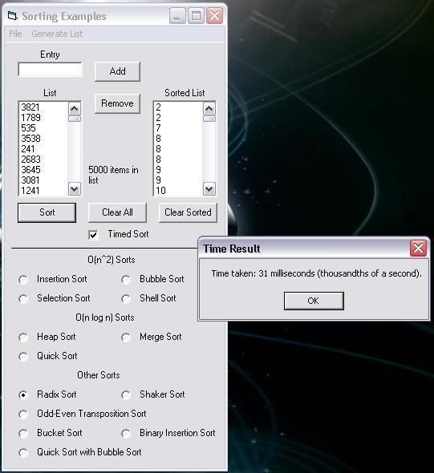



## Thirteen Sorting Methods \(Sorting V2\.0\)

### Description

This code is a newer revision of my ten sorts program. The added sorts are the following: Bucket Sort, Binary Insertion Sort, and Quick Sort with Bubble Sort. Each of the algorithms has it's own special advantages and disadvantages. New added features are generating lists that are random, sorted, or in reverse order. These lists can be generated in either 10 items, 500 items, 5000 items, or a custom list size! You can now also time how long the sort takes now! New sorts will be added as I discover them. Please leave feedback for more features!
 
### More Info
 
Some sorts need just the unsorted array and the number of items in the array, however, some sorts need also need a temporary array that is the same size as the unsorted array.

The bucket sort only works if there is no number less than 0 in the list, and there is no number in the list that is bigger than the number of items in the list. It is a very specific sort. There are also two unfinished and partially working sorts in the source. The bitonic sort, and the bottom-up merge sort, they will be finished soon, feel free to try and fix them yourselves!

Returns the sorted list!

None that I'm aware of!

             |
---                |---
**Submitted On**   |2003-08-03 00:25:34
**By**             |[Guillaume Couture\-Levesque](https://github.com/Planet-Source-Code/PSCIndex/blob/master/ByAuthor/guillaume-couture-levesque.md)
**Level**          |Advanced
**User Rating**    |5.0 (10 globes from 2 users)
**Compatibility**  |VB 5\.0, VB 6\.0
**Category**       |[Miscellaneous](https://github.com/Planet-Source-Code/PSCIndex/blob/master/ByCategory/miscellaneous__1-1.md)
**World**          |[Visual Basic](https://github.com/Planet-Source-Code/PSCIndex/blob/master/ByWorld/visual-basic.md)
**Archive File**   |[Thirteen\_S162343832003\.zip](https://github.com/Planet-Source-Code/guillaume-couture-levesque-thirteen-sorting-methods-sorting-v2-0__1-47351/archive/master.zip)

